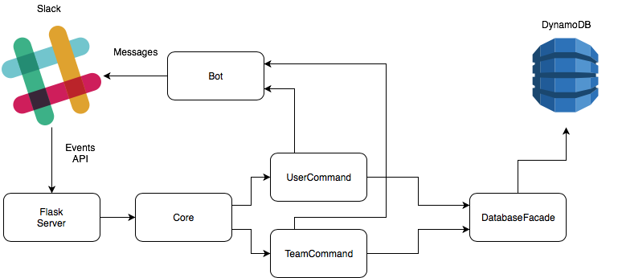

Architecture
============

Our Flask server serves to handle all incoming Slack events, slash command, and
Github webhooks. Slash commands are handled by :py:mod:`app.controller.command.parser`,
and the remaining events and webhooks are handled by :py:mod:`app.controller.webhook.github.core`
and :py:mod:`app.controller.webhook.slack.core`.

We store our data in an Amazon DynamoDB, which can be accessed directly by the
database facade :py:class:`db.dynamodb.DynamoDB`.

We treat GitHub itself as the sole source of truth. Any modifications done on the
Github side (e.g. changing team names, adding/removing team members,
creating/deleting teams, etc.) is reflected into the database.
Whenever an attempt is made at modifying the existing teams (e.g. using a slash
command to add/remove members, create/delete teams, edit teams), the changes are
made using the Github API, and then done on our database.

We run a cron-style scheduler that execute specific tasks at regular intervals.
To learn how to add tasks and modules to it, have a look at `this tutorial`_.

.. _this tutorial: DevelopmentTutorials.html#create-a-scheduler-module
